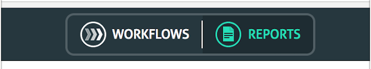

# Add Module Links in "ui-kit" Header 



UI-kit supports to add visual Modules buttons on header bar so you can make different modules buttons in your application. Module button will enable navigation to different modules of your application.

## Assumptions

- Module Screens are already created 
- Routing configuration is already declared in `app.routes.ts`
  
## Note
1. `$PROJECT_HOME` is root directory of the project that contains `package.json`.

## Steps to add modules links in header

### Step-1

1. Add modules entry in `config.ts` file in given below path.
    ```sh

      $PROJECT_HOME/apps/app/src/app/landing-page/config.ts

    ```

1. Each module has following property

    | Property Name   | Type    |Required | Description 
    | --------------  | ------- | ------- | --------- 
    | id              | String  | Y       | unique key to identify module
    | name            | String  | Y       | Display name of module 
    | state           | String  | Y       | This is custom information which can be used for navigation to a modules. i.e router path '/reports' will take user to reports module.
    | custom_key      | String  | N       | User can add custom  payload for more information here.


1. Sample Config for a module
    ```sh
    modules: [
          {
            id:"reports_module",
            name:"Reports",
            state:"/reports",
            my_key: {}
          }
        ]

    ```

### Step-2

1. Add custom icons for each module & its different state icons like hover, selected etc in file `navbar.less`.
    Path of file
    ```sh
    $PROJECT_HOME/apps/app/src/assets/less/navbar.less
    ```
1. Here you need to add your module id same as given "id" of step-1 id:"reports_module"
1. Provide svg icon & place in folder "images/modules/  (create modules folder in images if not created). Feel free to change your path.
1. SVG should be of size : 24 X 24 pixel
1. Provide all 3 states icons, normal, hover, selected.
1. Sample style code for module icons:

    ```sh
    .navbar-nav-center-template {
      >li#module_1 {
          >a {
              &:before {
                  background-image: url("<default module image path>");
              }
              &:hover {
                  &:before {
                      background-image: url("<hover module image path>");
                  }
              }
          }
      }
      >li#module_1.active {
          >a {
              &:before {
                  background-image: url("<selected module image path>");
              }
          }
      }
    }
    ```

### Step-3

Compile & re-run the application to see the modules button on header bar.
