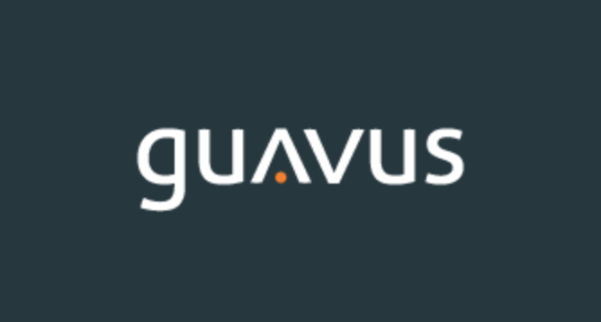

# reflex-ide

This project was generated with [Angular CLI](https://github.com/angular/angular-cli) version 1.7 using [Guavus workspace](https://confluence.guavus.com/pages/viewpage.action?pageId=132329133).

## Guavus Extensions for Angular (Gvs Schematics)

<a href="https://confluence.guavus.com/pages/viewpage.action?pageId=132329133"></a>

Guavus Schematics is internal open source toolkit for kick start Angular applications with basic understanding of guavus application flow.

Guavus Schematics is designed to help you create and build Guavus Angular applications faster. It provides an opinionated approach to application project structure and patterns.
It adds blueprints for common patterns used in Guavus Angular application

## Quick Start & Documentation
 This has  been drived from [Nrwl Nx](http://nrwl.io/nx). Feel free to watch introductory video on thier website
[Watch a 5-minute video on how to get started with Nx.](http://nrwl.io/nx)

The modifcation and change to standard Nrwl Nx workspace to craete a GVS-worskpace can be found [here](https://confluence.guavus.com/pages/viewpage.action?pageId=132329133)

## Generate your first application

Guavus workspace will create a workspace along with start application. To generate a new applications
 `npm install -g @guavus/gvs-workspace` and then `create-gvs-workspace <project-name>`. When using Guavus workspace, you can create multiple applications and libraries in the same CLI workspace. Read original Nx documnetation [here](http://nrwl.io/nx).

## Development server

Run `npm start` for a dev server of primary application. Navigate to `http://localhost:1986/`. The app will automatically reload if you change any of the source files.

For all otther application you can run `ng serve --app=myapp --port=<appport>` and Navigate to `http://localhost:appport/`. The app will automatically reload if you change any of the source files.

## Development server with AoT

Run `npm run start:aot` for a dev server of primary application. Navigate to `http://localhost:1986/`. The app will automatically reload if you change any of the source files.

For all other application you can run `ng serve --aot --app=myapp --port=<app-port>` and Navigate to `http://localhost:app-port/`. The app will automatically reload if you change any of the source files.

## Production build test server
Run `npm run start:prod` for a server of primary application with prod artifacts. Navigate to `http://localhost:8843/`. The app will *not* automatically reload if you change any of the source files.

For all other application you need to create a `bs-config.js` file replica and update the file locations and port infirmation. Add a new script in package.json. In future when we support multiple application OOTB then we will automate this changes

## Code scaffolding

Run `ng generate component component-name --app=myapp` to generate a new component. You can also use `ng generate directive|pipe|service|class|guard|interface|enum|module|json`.

## Build

Run `npm run build` to build the project. The build artifacts will be stored in the `dist/apps/<app-name>` directory. Use the `npm run build:prod`  for a production build. Prod will be AoT by default

## AOT Build
`npm run build:prod`  will generate an AoT build. To generate a dev AoT build use `ng build --aot` 

## Running unit tests

Run `ng test` to execute the unit tests via [Karma](https://karma-runner.github.io).

## Running end-to-end tests

Run `ng e2e` to execute the end-to-end tests via [Protractor](http://www.protractortest.org/).
Before running the tests make sure you are serving the app via `ng serve`.

## Creating a Docker Image

Prerequesites:

Install Docker on your machine. Add `artifacts.ggn.in.guavus.com:4245` in Docker Daemon registry.
Tested with Docker version ```18.03.1-ce-mac65```

1. To make docker build, go to project folder and run:
```bash
npm run docker:build
```
 
2. To test the image, run the command below to create a container 
```bash
npm run docker:run
```
Note: 
1. currently, we are running the container on ```port 4000```. 
 
  a.)If you have set baseHref to Non root location like "/{projectname}/" in that case we have enabled middleware proxy on port 8888 to redirect all request coming on host:8888/{projectname} to localhost:4000.
  b.)You might get an error that the port is already running, in that case, execute the following command to stop the running container:
  ```bash
    docker stop <running-container-name>
  ```
OR check if some other service is running on that port.

3. Before publishing to guavus gurgaon artifactory, login into docker
```bash
docker login artifacts.ggn.in.guavus.com:4245
```

4. Publishing to guavus gurgaon artifactory
```bash
npm run docker:tag
```
```bash
npm run docker:push
```

## Further help

To get more help on the Angular CLI use `ng help` or go check out the [Angular CLI README](https://github.com/angular/angular-cli/blob/master/README.md).
